  

  

<h2 align="center">CIS-155 Web Projects</h2>

  <i><b>This repository contains all coursework completed for the CIS-155 Web Development class at Olympic College.  
  Each assignment resides in its own folder for clarity, modularity, and version-control consistency.</b></i>

 

<table align="center" style="border-collapse:collapse;border:0;">
  <tr>
    <th align="left" style="color:#FFD700;">Project</th>
    <th align="left" style="color:#FFD700;">Description</th>
  </tr>
  <tr>
    <td style="color:#E6BE8A;"><b>Ch2Activity</b></td>
    <td style="color:#F8F8FF;">(Eric and Lindsey)</td>
  </tr>
  <tr>
    <td style="color:#E6BE8A;"><b>ALWAYS</b></td>
    <td style="color:#F8F8FF;">Module 3 Website</td>
  </tr>
  <tr>
    <td style="color:#E6BE8A;"><b>Dude</b></td>
    <td style="color:#F8F8FF;">Module 3 Website</td>
  </tr>
  <tr>
    <td style="color:#E6BE8A;"><b>Chapter 3, Part 1 Exercise Code</b></td>
    <td style="color:#F8F8FF;">Web-Dev / Find the Bugs</td>
  </tr>
  <tr>
    <td style="color:#E6BE8A;"><b>Chapter 3, Part 2 Exercise Code</b></td>
    <td style="color:#F8F8FF;">Identify Different HTML Structural Elements</td>
  </tr>
</table>

 

  <i>© 2025 Crystal Lyn Reise | “We are the ArchiTechs of the Digital Frontier.”</i>

